# 🎨 LMS Frontend Wireframe & Architecture

## 📐 System Architecture

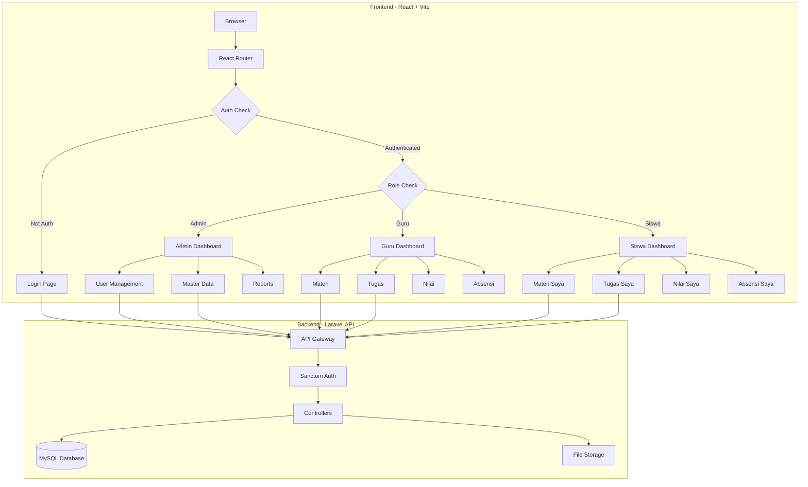

## 🏗️ Component Architecture

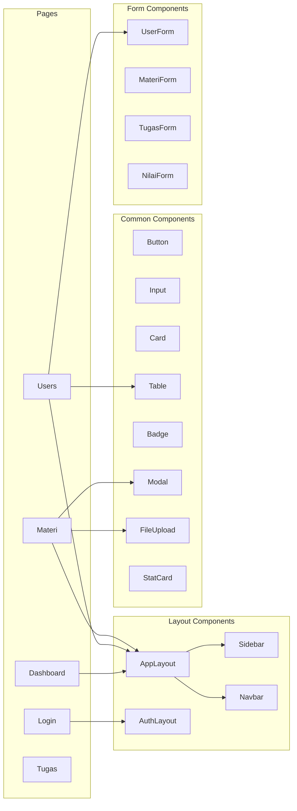

## 🔐 Authentication Flow

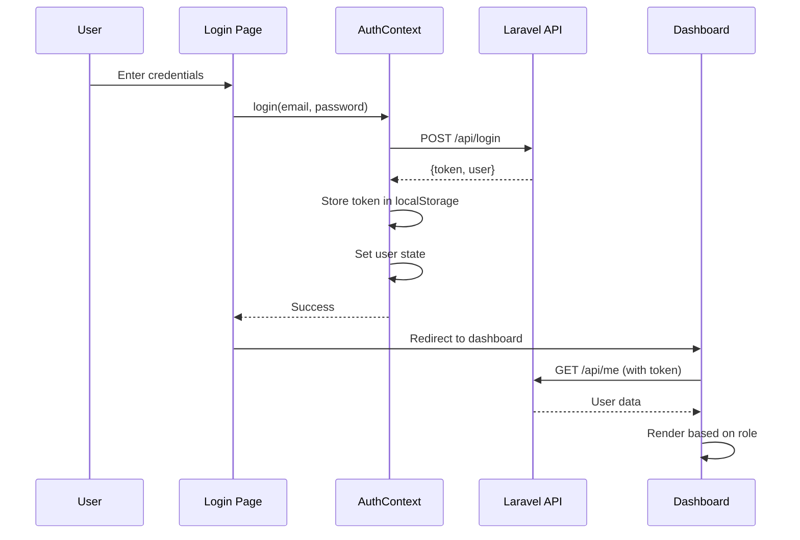

## 📱 Page Wireframes

### 1. Login Page

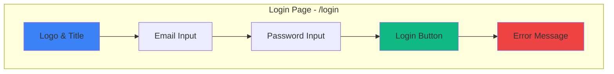

### 2. Admin Dashboard

```mermaid
graph TB
    subgraph "Admin Dashboard - /admin/dashboard"
        direction TB
        N[Navbar: User Info + Logout]
        
        subgraph "Main Content"
            S1[StatCard: Total Users]
            S2[StatCard: Total Guru]
            S3[StatCard: Total Siswa]
            S4[StatCard: Total Kelas]
            
            T1[Recent Users Table]
            T2[Quick Actions]
        end
        
        SB[Sidebar Menu]
        
        N --> S1
        S1 --> S2
        S2 --> S3
        S3 --> S4
        S4 --> T1
        T1 --> T2
        SB -.-> N
    end
    
    style N fill:#1e293b
    style SB fill:#334155
    style S1 fill:#3b82f6
    style S2 fill:#10b981
    style S3 fill:#f59e0b
    style S4 fill:#8b5cf6
```

### 3. Guru Dashboard

```mermaid
graph TB
    subgraph "Guru Dashboard - /guru/dashboard"
        direction TB
        N[Navbar]
        
        subgraph "Stats Row"
            S1[Total Materi]
            S2[Total Tugas]
            S3[Pending Submissions]
            S4[My Classes]
        end
        
        subgraph "Content Area"
            C1[Recent Materi]
            C2[Upcoming Deadlines]
            C3[Quick Actions]
        end
        
        SB[Sidebar: Materi, Tugas, Nilai, Absensi]
        
        N --> S1
        S1 --> S2
        S2 --> S3
        S3 --> S4
        S4 --> C1
        C1 --> C2
        C2 --> C3
        SB -.-> N
    end
    
    style N fill:#1e293b
    style SB fill:#334155
```

### 4. Siswa Dashboard

```mermaid
graph TB
    subgraph "Siswa Dashboard - /siswa/dashboard"
        direction TB
        N[Navbar]
        
        subgraph "Stats Row"
            S1[Materi Tersedia]
            S2[Tugas Aktif]
            S3[Tugas Terlambat]
            S4[Rata-rata Nilai]
        end
        
        subgraph "Content Area"
            C1[Materi Terbaru]
            C2[Tugas Deadline Terdekat]
            C3[Absensi Bulan Ini]
        end
        
        SB[Sidebar: Materi, Tugas, Nilai, Absensi]
        
        N --> S1
        S1 --> S2
        S2 --> S3
        S3 --> S4
        S4 --> C1
        C1 --> C2
        C2 --> C3
        SB -.-> N
    end
    
    style N fill:#1e293b
    style SB fill:#334155
    style S3 fill:#ef4444
```

## 🎯 User Management (Admin)

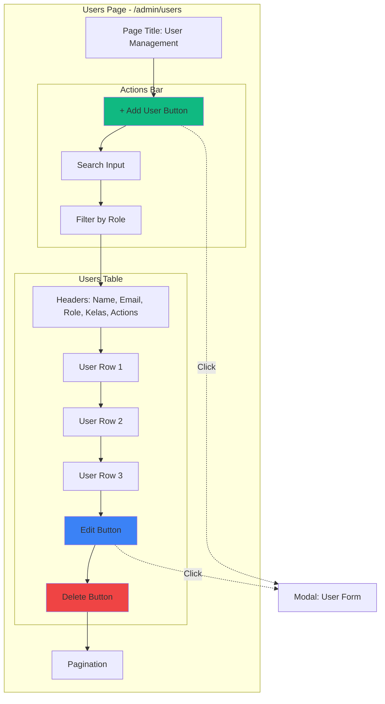

## 📚 Materi Management (Guru)

```mermaid
graph TB
    subgraph "Materi Page - /guru/materi"
        T[Page Title: Materi Pembelajaran]
        
        subgraph "Actions"
            B1[+ Upload Materi]
            F1[Filter by Kelas]
            F2[Filter by Mata Pelajaran]
        end
        
        subgraph "Materi Grid"
            C1[Card: Materi 1]
            C2[Card: Materi 2]
            C3[Card: Materi 3]
            
            subgraph "Card Content"
                CT[Title]
                CD[Description]
                CF[File Icon + Size]
                CA[Edit | Delete | Download]
            end
        end
        
        T --> B1
        B1 --> F1
        F1 --> F2
        F2 --> C1
        C1 --> C2
        C2 --> C3
        C1 --> CT
    end
    
    M[Modal: Upload Form]
    B1 -.->|Click| M
    
    style B1 fill:#10b981
```

## 📝 Tugas Management (Guru)

```mermaid
graph TB
    subgraph "Tugas Page - /guru/tugas"
        T[Page Title: Tugas]
        
        subgraph "Actions"
            B1[+ Buat Tugas Baru]
            F1[Filter by Status]
        end
        
        subgraph "Tugas List"
            T1[Tugas Card 1]
            T2[Tugas Card 2]
            
            subgraph "Card Details"
                TD[Title + Deadline]
                TS[Status Badge]
                TSub[Submissions: 20/30]
                TA[View | Edit | Delete]
            end
        end
        
        T --> B1
        B1 --> F1
        F1 --> T1
        T1 --> T2
        T1 --> TD
    end
    
    M[Modal: Create Tugas]
    D[Detail Page: Submissions]
    
    B1 -.->|Click| M
    TA -.->|View| D
    
    style B1 fill:#10b981
    style TS fill:#f59e0b
```

## 📊 Nilai Input (Guru)

```mermaid
graph TB
    subgraph "Nilai Input - /guru/nilai"
        T[Page Title: Input Nilai]
        
        subgraph "Filters"
            F1[Select Kelas]
            F2[Select Mata Pelajaran]
            F3[Select Jenis Nilai]
        end
        
        subgraph "Nilai Table"
            TH[Headers: No, Nama, NIS, Nilai, Keterangan]
            TR1[Siswa 1 | Input Field]
            TR2[Siswa 2 | Input Field]
            TR3[Siswa 3 | Input Field]
        end
        
        B[Save All Button]
        
        T --> F1
        F1 --> F2
        F2 --> F3
        F3 --> TH
        TH --> TR1
        TR1 --> TR2
        TR2 --> TR3
        TR3 --> B
    end
    
    style B fill:#10b981
    style TR1 fill:#f0f9ff
```

## 📋 Absensi Input (Guru)

```mermaid
graph TB
    subgraph "Absensi Page - /guru/absensi"
        T[Page Title: Absensi]
        
        subgraph "Filters"
            F1[Select Kelas]
            F2[Select Tanggal]
            F3[Select Mata Pelajaran]
        end
        
        subgraph "Absensi Table"
            TH[Headers: No, Nama, Status]
            TR1[Siswa 1 | H | S | I | A]
            TR2[Siswa 2 | H | S | I | A]
            TR3[Siswa 3 | H | S | I | A]
        end
        
        B[Save Absensi]
        
        T --> F1
        F1 --> F2
        F2 --> F3
        F3 --> TH
        TH --> TR1
        TR1 --> TR2
        TR2 --> TR3
        TR3 --> B
    end
    
    style B fill:#10b981
    style TR1 fill:#f0f9ff
```

## 🎓 Siswa - Materi View

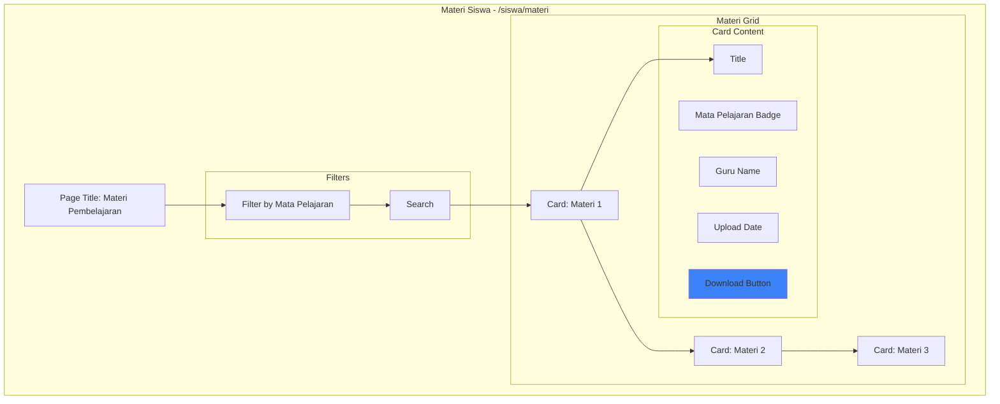

## 📝 Siswa - Tugas View

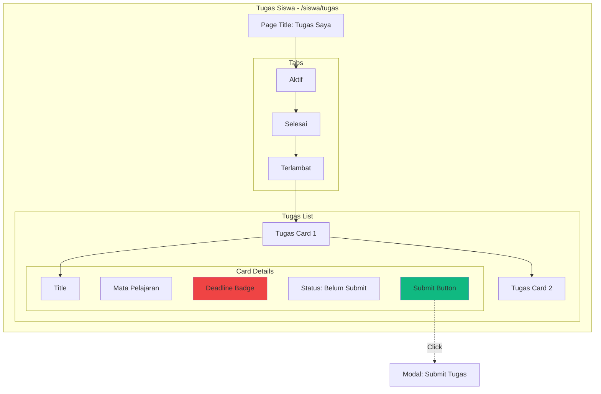

## 📊 Siswa - Nilai View

```mermaid
graph TB
    subgraph "Nilai Siswa - /siswa/nilai"
        T[Page Title: Nilai Saya]
        
        subgraph "Summary Cards"
            S1[Rata-rata: 85]
            S2[Tertinggi: 95]
            S3[Terendah: 70]
        end
        
        subgraph "Filters"
            F1[Filter by Semester]
            F2[Filter by Mata Pelajaran]
        end
        
        subgraph "Nilai Table"
            TH[Headers: Mata Pelajaran, Tugas, UTS, UAS, Rata-rata]
            TR1[Matematika | 85 | 80 | 90 | 85]
            TR2[Bahasa Indonesia | 90 | 85 | 88 | 87.7]
            TR3[IPA | 75 | 80 | 85 | 80]
        end
        
        CH[Chart: Nilai per Mata Pelajaran]
        
        T --> S1
        S1 --> S2
        S2 --> S3
        S3 --> F1
        F1 --> F2
        F2 --> TH
        TH --> TR1
        TR1 --> TR2
        TR2 --> TR3
        TR3 --> CH
    end
    
    style S1 fill:#3b82f6
    style S2 fill:#10b981
    style S3 fill:#f59e0b
```

## 📅 Siswa - Absensi View

```mermaid
graph TB
    subgraph "Absensi Siswa - /siswa/absensi"
        T[Page Title: Absensi Saya]
        
        subgraph "Summary Cards"
            S1[Hadir: 45]
            S2[Sakit: 2]
            S3[Izin: 1]
            S4[Alpha: 0]
        end
        
        subgraph "Filters"
            F1[Filter by Bulan]
            F2[Filter by Mata Pelajaran]
        end
        
        subgraph "Absensi Table"
            TH[Headers: Tanggal, Mata Pelajaran, Status, Keterangan]
            TR1[2024-01-15 | Matematika | H | -]
            TR2[2024-01-16 | B. Indonesia | S | Demam]
            TR3[2024-01-17 | IPA | H | -]
        end
        
        CH[Chart: Absensi per Bulan]
        
        T --> S1
        S1 --> S2
        S2 --> S3
        S3 --> S4
        S4 --> F1
        F1 --> F2
        F2 --> TH
        TH --> TR1
        TR1 --> TR2
        TR2 --> TR3
        TR3 --> CH
    end
    
    style S1 fill:#10b981
    style S2 fill:#f59e0b
    style S3 fill:#3b82f6
    style S4 fill:#ef4444
```

## 🎨 Design System

### Color Palette

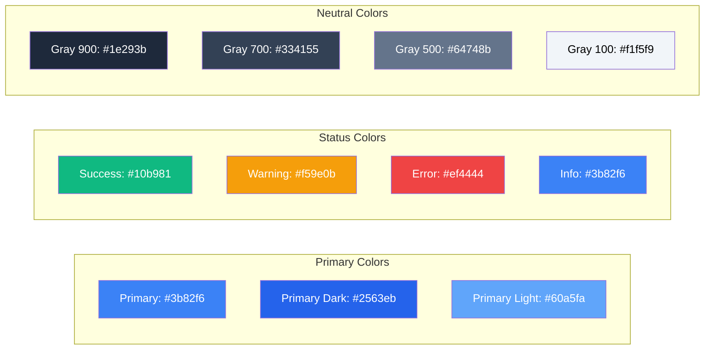

## 🔄 State Management

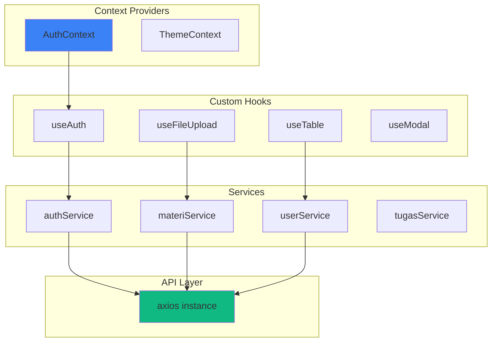

## 📱 Responsive Breakpoints

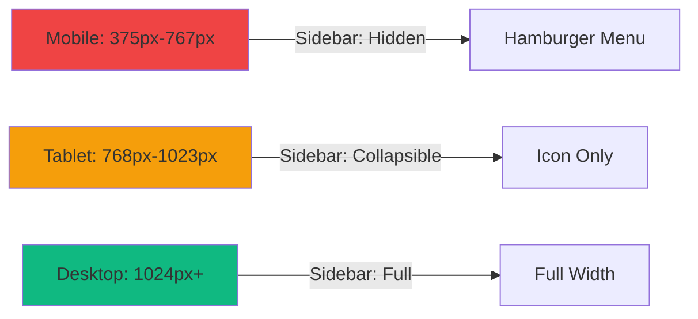

## 🚀 Navigation Structure

```mermaid
graph TB
    R[Root /]
    
    subgraph "Public Routes"
        L[/login]
    end
    
    subgraph "Admin Routes /admin"
        AD[/dashboard]
        AU[/users]
        AJ[/jurusan]
        AK[/kelas]
        AM[/mata-pelajaran]
        AS[/jadwal]
    end
    
    subgraph "Guru Routes /guru"
        GD[/dashboard]
        GM[/materi]
        GT[/tugas]
        GN[/nilai]
        GA[/absensi]
    end
    
    subgraph "Siswa Routes /siswa"
        SD[/dashboard]
        SM[/materi]
        ST[/tugas]
        SN[/nilai]
        SA[/absensi]
    end
    
    R --> L
    R --> AD
    R --> GD
    R --> SD
    
    AD --> AU
    AU --> AJ
    AJ --> AK
    AK --> AM
    AM --> AS
    
    GD --> GM
    GM --> GT
    GT --> GN
    GN --> GA
    
    SD --> SM
    SM --> ST
    ST --> SN
    SN --> SA
    
    style L fill:#3b82f6
    style AD fill:#8b5cf6
    style GD fill:#10b981
    style SD fill:#f59e0b
```

---

## 📝 Notes

### Design Principles
1. **Consistency**: Gunakan komponen yang sama di seluruh aplikasi
2. **Accessibility**: Pastikan semua elemen dapat diakses dengan keyboard
3. **Responsive**: Mobile-first approach
4. **Performance**: Lazy loading untuk route dan komponen besar
5. **User Feedback**: Loading states, error messages, success notifications

### Key Features
- Role-based navigation
- File upload/download
- Bulk operations (nilai, absensi)
- Real-time validation
- Search & filter
- Pagination
- Dark mode support
- Responsive design

### Tech Stack
- **Framework**: React 18 + Vite
- **Styling**: Tailwind CSS
- **Routing**: React Router v6
- **HTTP Client**: Axios
- **Icons**: Lucide React
- **Animations**: Framer Motion
- **Forms**: React Hook Form (optional)
- **State**: Context API + Custom Hooks

---

**Ready for Phase 2 Implementation! 🚀**
