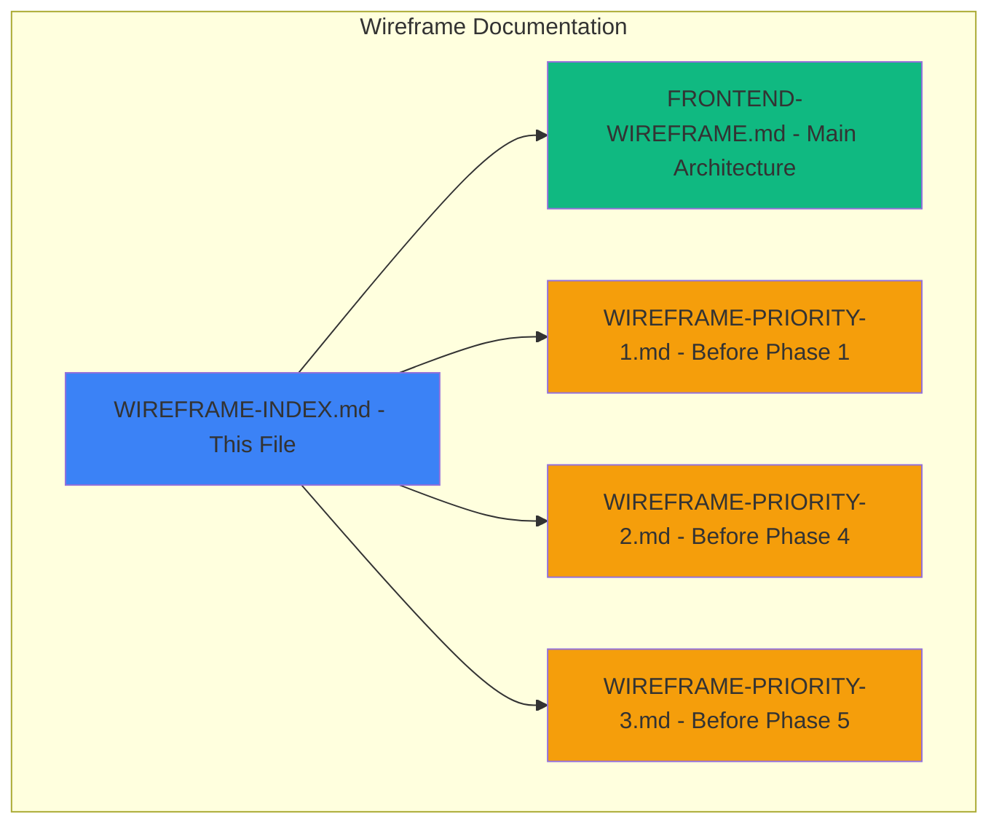
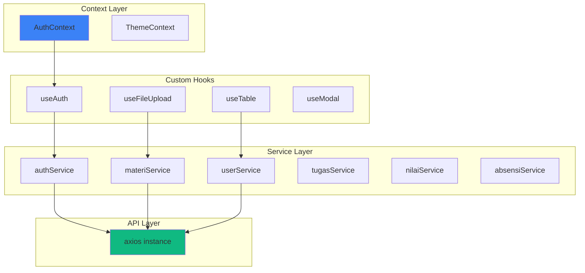
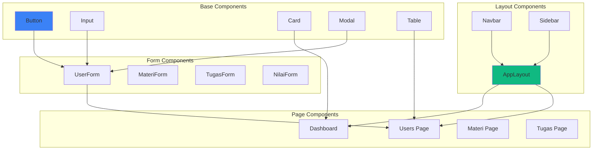

# 🎨 LMS Frontend Wireframe - Complete Index

## 📚 Documentation Structure



---

## 📖 Quick Navigation

### 🏗️ Main Architecture (FRONTEND-WIREFRAME.md)
- System Architecture
- Component Architecture
- Authentication Flow
- Page Wireframes (Login, Dashboards)
- User Management
- Materi & Tugas Management
- Nilai & Absensi Views
- Design System & Color Palette
- State Management
- Navigation Structure

**When to read:** Before starting any phase, for overall understanding

---

### 🎯 Priority 1 - Before Phase 1 Setup (WIREFRAME-PRIORITY-1.md)

#### 📐 Navbar Design Detail
- Full navbar structure
- Profile dropdown with avatar
- Logout button placement
- Responsive behavior (Desktop/Tablet/Mobile)
- Breadcrumb navigation

#### 🧩 Component Library
- **Button Component**
  - 6 variants (primary, secondary, outline, ghost, link, danger)
  - 5 sizes (xs, sm, md, lg, xl)
  - States (default, hover, active, disabled, loading)
  - With icons (left, right, icon-only)

- **Input Component**
  - 8 types (text, email, password, number, date, textarea, select, file)
  - States (default, focus, error, success, disabled, read-only)
  - With label, helper text, error message
  - Icon support, clearable option

- **Card Component**
  - 5 variants (default, bordered, elevated, flat, colored)
  - Header with title, subtitle, action
  - Body content area
  - Footer section
  - Special cards (StatCard, UserCard, MateriCard, TugasCard)

- **Modal Component**
  - 5 sizes (sm, md, lg, xl, full)
  - Header with title and close button
  - Scrollable body
  - Footer with action buttons
  - Overlay with close on click/ESC

- **Table Component**
  - Sortable columns
  - Selectable rows
  - Pagination
  - Loading state
  - Empty state
  - Row actions
  - Responsive (horizontal scroll on mobile)

#### 🎭 Error/Empty/Loading States
- **Loading States**
  - Skeleton loaders (card, table, form, text)
  - Spinners (full page, button, inline, overlay)
  - Progress indicators (linear, circular, upload)

- **Empty States**
  - No data, no results, no files, no notifications, no access
  - With icon, title, description, action button

- **Error States**
  - Network error (500), Not found (404), Unauthorized (401), Forbidden (403)
  - With error icon, title, description, code, retry button

- **Toast Notifications**
  - 4 types (success, error, warning, info)
  - Auto-dismiss with duration
  - Position options
  - Closable

#### ⚙️ Settings Page
- **4 Tabs:**
  1. Profil (avatar, personal info, role info)
  2. Keamanan (change password, login history)
  3. Notifikasi (email & push settings)
  4. Tampilan (theme, language, display options)

#### 📱 Responsive Behavior
- Desktop (1024px+): Full navbar, sidebar always visible
- Tablet (768px-1023px): Compact navbar, collapsible sidebar
- Mobile (375px-767px): Minimal navbar, overlay sidebar

#### 🎨 Style Tokens
- Spacing scale (xs to 3xl)
- Border radius (sm to full)
- Shadow scale (sm to xl)
- Typography scale (xs to 4xl)

**When to read:** Before implementing Phase 1 components

---

### 🎯 Priority 2 - Before Phase 4 CRUD (WIREFRAME-PRIORITY-2.md)

#### 📋 Admin CRUD Pages

1. **Jurusan Management**
   - Table columns: No, Kode, Nama, Deskripsi, Status, Aksi
   - Search, filter by status
   - Add/Edit/Delete actions

2. **Kelas Management**
   - Table columns: No, Nama Kelas, Jurusan, Tingkat, Wali Kelas, Jml Siswa, Aksi
   - Filter by jurusan and tingkat
   - View students action

3. **Mata Pelajaran Management**
   - Table columns: No, Kode, Nama, Kategori, Jurusan, SKS, Aksi
   - Filter by kategori and jurusan
   - Kategori: Umum, Produktif, Muatan Lokal

4. **Jadwal Pelajaran**
   - **Calendar View:** Weekly grid with time slots
   - **Table View:** List with columns (Hari, Jam, Mapel, Guru, Kelas, Ruangan)
   - Conflict detection
   - Export to PDF

#### 📝 Form Component Specifications

1. **UserForm**
   - Fields: Nama, Email, Password, Role
   - Conditional fields for Guru (NIP, Telepon, Mata Pelajaran)
   - Conditional fields for Siswa (NIS, Kelas, Telepon Ortu, Jenis Kelamin, Tanggal Lahir)
   - Validation rules for each field

2. **JurusanForm**
   - Fields: Kode (3-4 chars, uppercase), Nama, Deskripsi, Status
   - Simple validation

3. **KelasForm**
   - Fields: Nama Kelas, Jurusan, Tingkat, Wali Kelas, Kapasitas, Tahun Ajaran
   - Pattern validation for nama kelas (e.g., "X RPL 1")

4. **MataPelajaranForm**
   - Fields: Kode, Nama, Kategori, Jurusan, SKS, Tingkat, Deskripsi
   - Multiple jurusan and tingkat selection

5. **JadwalForm**
   - Fields: Hari, Jam Mulai, Jam Selesai, Mata Pelajaran, Guru, Kelas, Ruangan, Semester
   - Auto-detect conflicts
   - Filter guru by mata pelajaran
   - Save & Add Another option

#### 🎯 Form Field Types Reference
- Text input variants (8 types)
- Select/Dropdown variants (5 types)
- Other inputs (textarea, toggle, radio, checkbox, file, rich text)

#### 🔄 CRUD Operation Flows
- Create flow (with validation)
- Edit flow (load data, modify, save)
- Delete flow (with confirmation)

#### 📊 Table Features
- Sortable columns (3 states: unsorted, ascending, descending)
- Bulk actions (select all, bulk delete, bulk export)
- Pagination (with items per page selector)

**When to read:** Before implementing Phase 4 CRUD operations

---

### 🎯 Priority 3 - Before Phase 5 File Upload (WIREFRAME-PRIORITY-3.md)

#### 📤 File Upload Component

1. **Upload Area States**
   - Default: Drag & drop or browse
   - Drag over: Blue highlight
   - Uploading: Progress bar with percentage
   - Success: Check icon with preview
   - Error: Error icon with retry

2. **File Preview Card**
   - File icon (based on type)
   - File name, size, upload date
   - Download and delete buttons

3. **Multiple File Upload**
   - File list with individual status
   - Add more files button
   - Queue management

4. **File Type Icons**
   - PDF (red), DOC (blue), XLS (green), PPT (orange)
   - ZIP (purple), Image (pink), Video (teal), Other (gray)

5. **Upload Progress**
   - Progress bar with percentage
   - Speed and time remaining
   - Cancel upload button

#### 📝 Guru: Materi Upload Form
- Fields: Judul, Mata Pelajaran, Kelas (multiple), Kategori, Deskripsi
- Drag & drop file upload (multiple files)
- Tanggal publish, toggle langsung publish
- Save as draft or publish
- Validation: max 10MB per file, allowed types

#### 📊 Guru: Nilai Input - Inline Table
- Filter: Kelas, Mata Pelajaran, Jenis Nilai
- Inline editable table
- Auto-validate 0-100 range
- Status badges (Saved, Modified, Not Filled)
- Summary: Total siswa, sudah dinilai, belum dinilai, rata-rata
- Save all changes, export to Excel

**Jenis Nilai:** Tugas, Quiz, UTS, UAS, Praktik, Proyek

#### 📋 Guru: Absensi Input
- Filter: Kelas, Mata Pelajaran, Tanggal, Jam Pelajaran
- Quick actions: Set all to H/S/I/A
- Status button group for each student (H/S/I/A)
- Keyboard shortcuts (H, S, I, A, Tab, Enter)
- Summary: Hadir, Sakit, Izin, Alpha counts
- Save absensi, export to PDF

#### 📝 Tugas Submission Detail (Grading)
- Submission list with filters (All/Submitted/Not Submitted/Graded/Not Graded)
- Sort by name/submit time/score
- Submission cards with status badges
- Grading modal:
  - Student info
  - File preview/download
  - Nilai input (0-100)
  - Catatan/feedback textarea
  - Feedback file upload
  - Save & Next student

**Status Badges:** On Time (green), Late (red), Not Submitted (gray), Graded (blue), Not Graded (yellow)

#### 📥 Siswa: Tugas Submission Form
- Tugas info (read-only)
- Deadline warning with color coding
- Catatan textarea
- File upload (max 5 files)
- Previous submission info (if exists)
- Warning before submit

**Deadline Warnings:**
- \> 7 days: Green (Plenty of time)
- 3-7 days: Blue (Normal)
- 1-2 days: Yellow (Soon)
- < 24 hours: Orange (Urgent)
- < 1 hour: Red (Very Urgent)
- Overdue: Dark Red (Late)

#### 🎯 File Upload Props & API
- Component props specification
- Upload API endpoints (upload, delete, download)

#### 📊 Grading Statistics
- Bar chart: Score distribution
- Pie chart: Submission status
- Stats: Highest, Lowest, Average, Median, Submitted count, On time count

#### 🔔 Notification System
- Triggers: New tugas, deadline warnings, new submission, tugas graded
- Channels: In-app, email, browser push

**When to read:** Before implementing Phase 5 file upload and grading features

---

## 🎨 Design System Summary

### Color Palette
```
Primary: #3b82f6 (Blue)
Success: #10b981 (Green)
Warning: #f59e0b (Orange)
Error: #ef4444 (Red)
Info: #3b82f6 (Blue)

Gray Scale:
- 900: #1e293b (Dark)
- 700: #334155 (Medium)
- 500: #64748b (Light)
- 100: #f1f5f9 (Very Light)
```

### Typography
```
Font Family: Poppins
Sizes: 12px, 14px, 16px, 18px, 20px, 24px, 30px, 36px
Weights: 400 (Regular), 500 (Medium), 600 (Semibold), 700 (Bold)
```

### Spacing
```
xs: 4px, sm: 8px, md: 16px, lg: 24px, xl: 32px, 2xl: 48px, 3xl: 64px
```

### Border Radius
```
sm: 4px, md: 8px, lg: 12px, xl: 16px, full: 9999px
```

### Shadows
```
sm: 0 1px 2px rgba(0,0,0,0.05)
md: 0 4px 6px rgba(0,0,0,0.1)
lg: 0 10px 15px rgba(0,0,0,0.1)
xl: 0 20px 25px rgba(0,0,0,0.1)
```

---

## 📱 Responsive Breakpoints

```
Mobile: 375px - 767px
Tablet: 768px - 1023px
Desktop: 1024px+
```

### Component Behavior by Breakpoint

| Component | Desktop | Tablet | Mobile |
|-----------|---------|--------|--------|
| Navbar | Full with breadcrumb | Compact | Minimal |
| Sidebar | Always visible | Collapsible | Overlay |
| Modal | Center, max width | 90% width | Full screen |
| Table | Full width | Horizontal scroll | Card view |
| Cards | Grid 3-4 columns | Grid 2 columns | Stack 1 column |

---

## 🔄 State Management Architecture



---

## 🚀 Implementation Checklist

### Phase 1 - Setup & Components
- [ ] Read WIREFRAME-PRIORITY-1.md
- [ ] Implement Navbar with profile dropdown
- [ ] Create all common components (Button, Input, Card, Modal, Table)
- [ ] Implement loading states (skeleton, spinner)
- [ ] Implement empty states
- [ ] Implement error states
- [ ] Implement toast notifications
- [ ] Create Settings page with 4 tabs
- [ ] Test responsive behavior

### Phase 2-3 - Auth & Dashboard
- [ ] Read FRONTEND-WIREFRAME.md
- [ ] Implement authentication flow
- [ ] Create Login page
- [ ] Create Admin Dashboard
- [ ] Create Guru Dashboard
- [ ] Create Siswa Dashboard
- [ ] Implement role-based routing

### Phase 4 - CRUD Management
- [ ] Read WIREFRAME-PRIORITY-2.md
- [ ] Create Jurusan CRUD pages
- [ ] Create Kelas CRUD pages
- [ ] Create Mata Pelajaran CRUD pages
- [ ] Create Jadwal pages (calendar & table view)
- [ ] Implement all form components
- [ ] Implement table features (sort, filter, pagination)
- [ ] Test all CRUD operations

### Phase 5 - File Upload & Grading
- [ ] Read WIREFRAME-PRIORITY-3.md
- [ ] Implement FileUpload component
- [ ] Create Materi upload form (Guru)
- [ ] Create Nilai input page with inline editing
- [ ] Create Absensi input page with quick actions
- [ ] Create Tugas submission detail with grading
- [ ] Create Tugas submission form (Siswa)
- [ ] Implement grading statistics
- [ ] Implement notification system

---

## 📊 Component Dependency Graph



---

## 🎯 Key Features Summary

### Authentication & Authorization
- ✅ Role-based access (Admin, Guru, Siswa)
- ✅ Protected routes
- ✅ Profile dropdown with logout
- ✅ Session management

### User Management
- ✅ CRUD operations
- ✅ Role-specific fields
- ✅ Search & filter
- ✅ Pagination

### Master Data Management
- ✅ Jurusan, Kelas, Mata Pelajaran
- ✅ Jadwal (calendar & table view)
- ✅ Conflict detection

### Materi Management
- ✅ File upload (drag & drop)
- ✅ Multiple file support
- ✅ File preview & download
- ✅ Filter by kelas & mapel

### Tugas Management
- ✅ Create tugas with deadline
- ✅ File submission
- ✅ Grading system
- ✅ Feedback mechanism
- ✅ Statistics dashboard

### Nilai Management
- ✅ Inline table editing
- ✅ Multiple jenis nilai
- ✅ Auto-validation
- ✅ Export to Excel

### Absensi Management
- ✅ Quick status buttons
- ✅ Keyboard shortcuts
- ✅ Bulk actions
- ✅ Export to PDF

### UI/UX Features
- ✅ Responsive design
- ✅ Dark mode support
- ✅ Loading states
- ✅ Error handling
- ✅ Toast notifications
- ✅ Empty states

---

## 📞 Support & References

### Documentation Files
1. `FRONTEND-WIREFRAME.md` - Main architecture & page wireframes
2. `WIREFRAME-PRIORITY-1.md` - Components & states (Phase 1)
3. `WIREFRAME-PRIORITY-2.md` - CRUD pages & forms (Phase 4)
4. `WIREFRAME-PRIORITY-3.md` - File upload & grading (Phase 5)
5. `WIREFRAME-INDEX.md` - This file (navigation & summary)

### Related Files
- `CHECKLIST.md` - Development checklist
- `PROJECT-STRUCTURE.md` - Project structure
- `QUICK-START.md` - Quick start guide
- `README.md` - Main documentation

---

## ✅ Status

- **FRONTEND-WIREFRAME.md:** ✅ Complete
- **WIREFRAME-PRIORITY-1.md:** ✅ Complete
- **WIREFRAME-PRIORITY-2.md:** ✅ Complete
- **WIREFRAME-PRIORITY-3.md:** ✅ Complete
- **WIREFRAME-INDEX.md:** ✅ Complete

**All wireframes are ready for implementation! 🚀**

---

**Last Updated:** 2024-01-15
**Version:** 1.0.0
**Status:** Ready for Phase 2 Implementation
