# 🎨 Priority 1 Wireframes - Before Phase 1

## 📐 Navbar Design Detail

```mermaid
graph TB
    subgraph "Navbar Component - Full Width"
        direction LR
        
        subgraph "Left Section"
            L1[Hamburger Menu Icon - Mobile Only]
            L2[App Logo/Title: LMS Sekolah]
        end
        
        subgraph "Center Section"
            C1[Breadcrumb Navigation]
            C2[Dashboard > Users > Edit]
        end
        
        subgraph "Right Section"
            R1[Search Icon - Optional]
            R2[Notification Bell - Optional]
            R3[Theme Toggle - Dark/Light]
            R4[Profile Dropdown Trigger]
        end
        
        L1 --> L2
        L2 --> C1
        C1 --> C2
        C2 --> R1
        R1 --> R2
        R2 --> R3
        R3 --> R4
    end
    
    style L1 fill:#64748b
    style R3 fill:#f59e0b
    style R4 fill:#3b82f6
```

### Profile Dropdown Detail

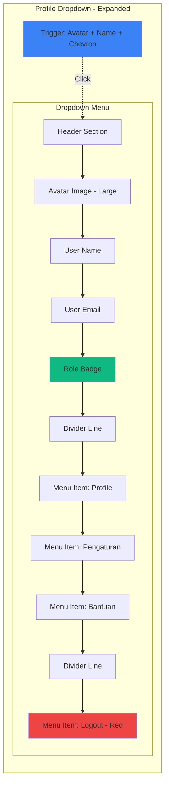

### Navbar States

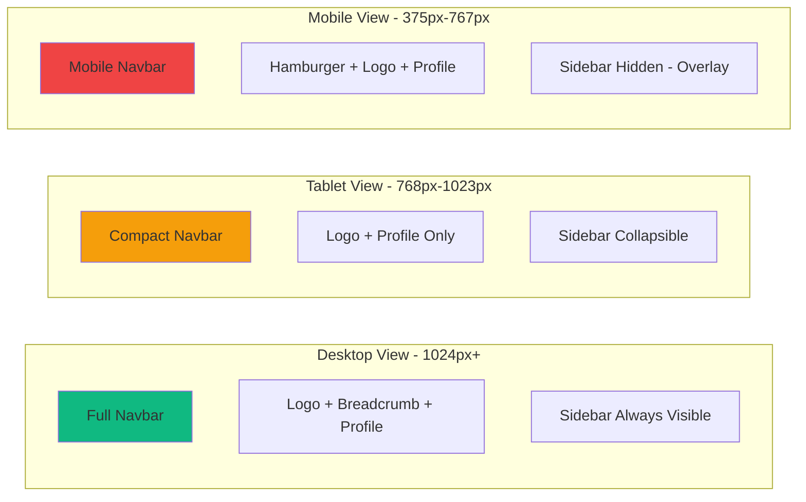

---

## 🧩 Component Library Wireframes

### 1. Button Component Variants

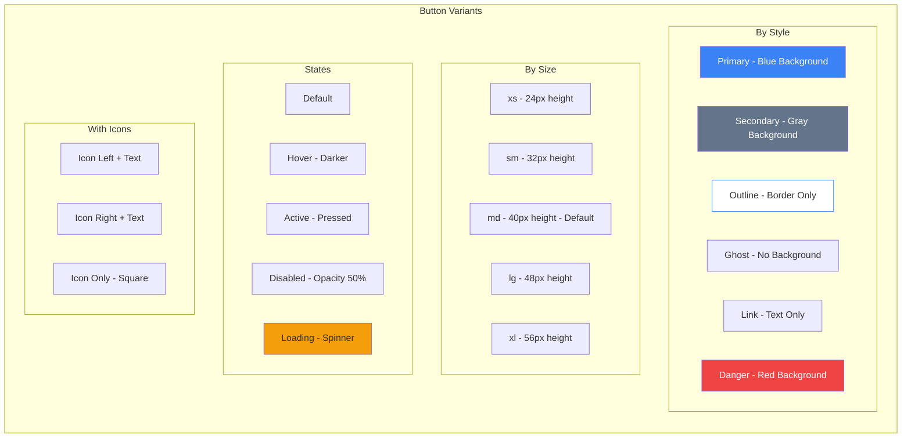

**Button Props:**
```javascript
{
  variant: 'primary' | 'secondary' | 'outline' | 'ghost' | 'link' | 'danger',
  size: 'xs' | 'sm' | 'md' | 'lg' | 'xl',
  disabled: boolean,
  loading: boolean,
  icon: ReactNode,
  iconPosition: 'left' | 'right',
  fullWidth: boolean,
  onClick: () => void
}
```

### 2. Input Component Variants

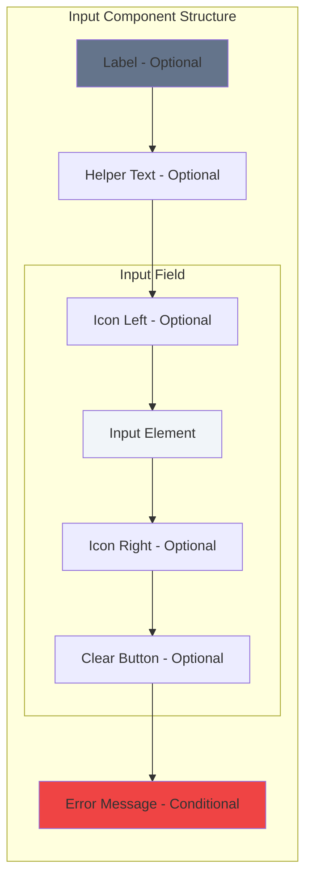

**Input Types & States:**

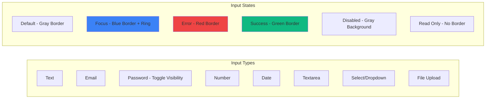

**Input Props:**
```javascript
{
  type: 'text' | 'email' | 'password' | 'number' | 'date' | 'textarea' | 'select',
  label: string,
  placeholder: string,
  helperText: string,
  error: string,
  disabled: boolean,
  readOnly: boolean,
  required: boolean,
  icon: ReactNode,
  iconPosition: 'left' | 'right',
  clearable: boolean,
  rows: number, // for textarea
  options: Array, // for select
}
```

### 3. Card Component Variants

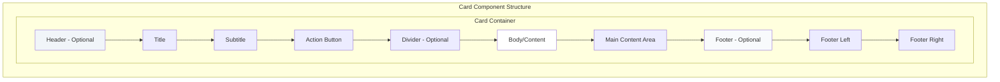

**Card Variants:**

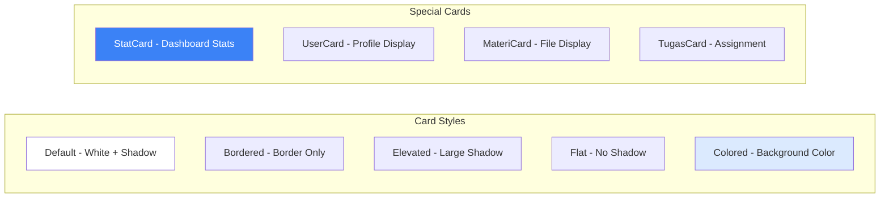

**Card Props:**
```javascript
{
  variant: 'default' | 'bordered' | 'elevated' | 'flat' | 'colored',
  title: string,
  subtitle: string,
  headerAction: ReactNode,
  footer: ReactNode,
  hoverable: boolean,
  clickable: boolean,
  padding: 'none' | 'sm' | 'md' | 'lg',
}
```

### 4. Modal Component

```mermaid
graph TB
    subgraph "Modal Structure"
        O[Overlay - Dark Background]
        
        subgraph "Modal Container"
            H[Header]
            HT[Title]
            HC[Close Button X]
            
            D[Divider]
            
            B[Body]
            BC[Content Area - Scrollable]
            
            D2[Divider]
            
            F[Footer]
            FB1[Cancel Button]
            FB2[Action Button]
        end
        
        O -.-> H
        H --> HT
        HT --> HC
        HC --> D
        D --> B
        B --> BC
        BC --> D2
        D2 --> F
        F --> FB1
        FB1 --> FB2
    end
    
    style O fill:#00000080
    style HC fill:#ef4444
    style FB2 fill:#3b82f6
```

**Modal Sizes:**

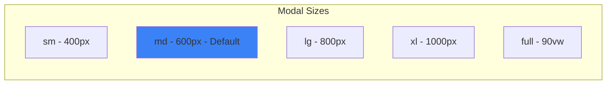

**Modal Props:**
```javascript
{
  isOpen: boolean,
  onClose: () => void,
  title: string,
  size: 'sm' | 'md' | 'lg' | 'xl' | 'full',
  closeOnOverlay: boolean,
  closeOnEsc: boolean,
  showCloseButton: boolean,
  footer: ReactNode,
  preventScroll: boolean,
}
```

### 5. Table Component

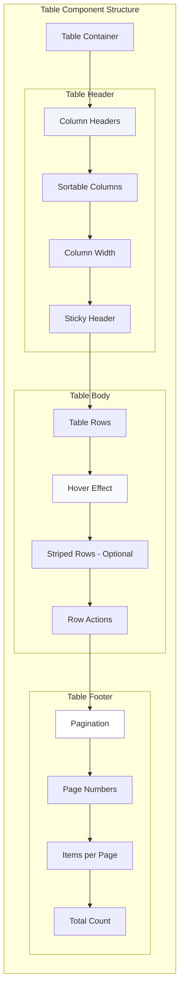

**Table Features:**

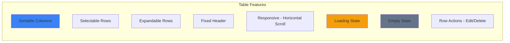

**Table Props:**
```javascript
{
  columns: Array<{
    key: string,
    label: string,
    sortable: boolean,
    width: string,
    render: (value, row) => ReactNode
  }>,
  data: Array<Object>,
  loading: boolean,
  emptyMessage: string,
  striped: boolean,
  hoverable: boolean,
  selectable: boolean,
  onRowClick: (row) => void,
  pagination: {
    page: number,
    pageSize: number,
    total: number,
    onPageChange: (page) => void
  }
}
```

---

## 🎭 Error/Empty/Loading State Wireframes

### 1. Loading States

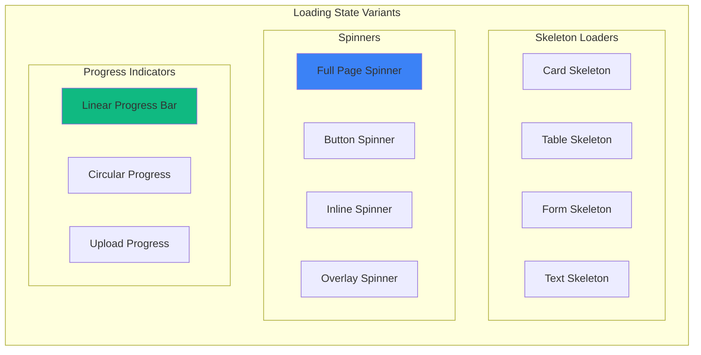

**Loading State Examples:**

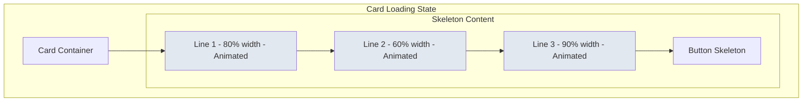

### 2. Empty States

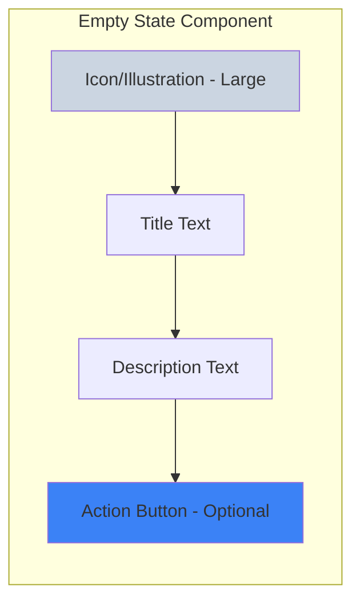

**Empty State Variants:**

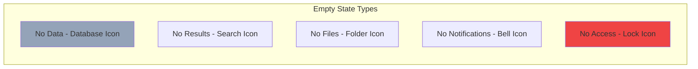

**Empty State Messages:**
- **No Users:** "Belum ada user terdaftar. Klik tombol 'Tambah User' untuk memulai."
- **No Materi:** "Belum ada materi tersedia. Upload materi pertama Anda."
- **No Tugas:** "Tidak ada tugas aktif saat ini."
- **No Search Results:** "Tidak ditemukan hasil untuk '{query}'. Coba kata kunci lain."
- **No Permission:** "Anda tidak memiliki akses ke halaman ini."

### 3. Error States

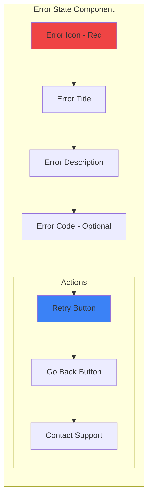

**Error Types:**

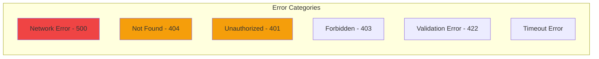

**Error Messages:**
- **500:** "Terjadi kesalahan server. Silakan coba lagi."
- **404:** "Halaman tidak ditemukan."
- **401:** "Sesi Anda telah berakhir. Silakan login kembali."
- **403:** "Anda tidak memiliki izin untuk mengakses ini."
- **Network:** "Tidak dapat terhubung ke server. Periksa koneksi internet Anda."

### 4. Toast Notifications

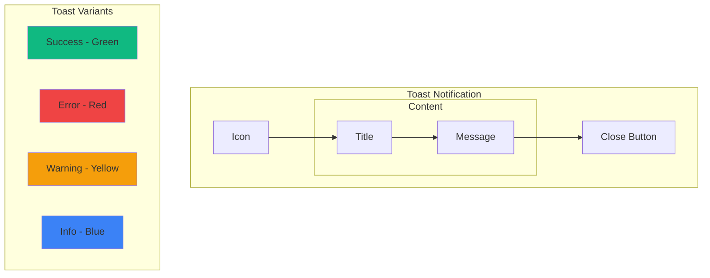

**Toast Props:**
```javascript
{
  type: 'success' | 'error' | 'warning' | 'info',
  title: string,
  message: string,
  duration: number, // ms, default 3000
  position: 'top-right' | 'top-center' | 'bottom-right' | 'bottom-center',
  closable: boolean,
}
```

---

## ⚙️ Settings Page Wireframe

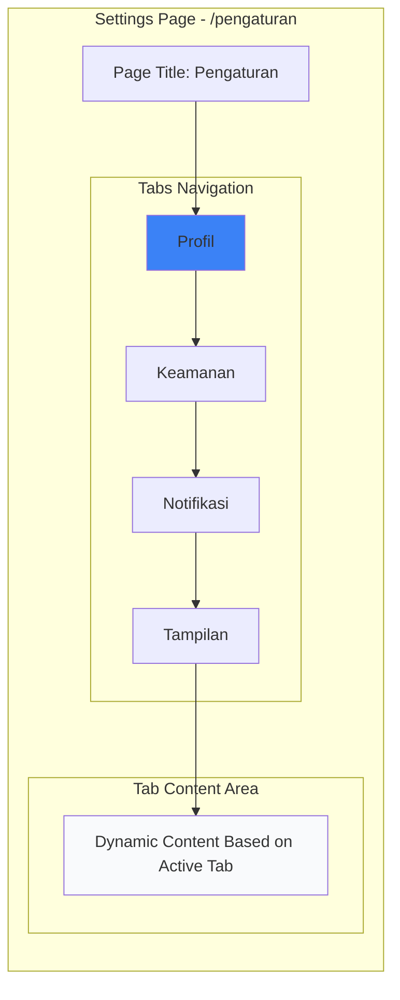

### Tab 1: Profil

```mermaid
graph TB
    subgraph "Profil Tab"
        direction TB
        
        subgraph "Avatar Section"
            A[Current Avatar - Large Circle]
            B1[Upload Button]
            B2[Remove Button]
        end
        
        subgraph "Form Fields"
            F1[Input: Nama Lengkap]
            F2[Input: Email - Read Only]
            F3[Input: No. Telepon]
            F4[Select: Jenis Kelamin]
            F5[Textarea: Alamat]
            F6[Input: Tanggal Lahir]
        end
        
        subgraph "Role Info - Read Only"
            R1[Badge: Role]
            R2[Text: Kelas - If Siswa]
            R3[Text: NIP/NIS]
        end
        
        S[Save Changes Button]
        
        A --> B1
        B1 --> B2
        B2 --> F1
        F1 --> F2
        F2 --> F3
        F3 --> F4
        F4 --> F5
        F5 --> F6
        F6 --> R1
        R1 --> R2
        R2 --> R3
        R3 --> S
    end
    
    style A fill:#e2e8f0
    style S fill:#10b981
    style R1 fill:#3b82f6
```

### Tab 2: Keamanan

```mermaid
graph TB
    subgraph "Keamanan Tab"
        direction TB
        
        S1[Section: Ubah Password]
        
        subgraph "Password Form"
            P1[Input: Password Lama]
            P2[Input: Password Baru]
            P3[Input: Konfirmasi Password]
            P4[Password Strength Indicator]
        end
        
        B1[Update Password Button]
        
        D[Divider]
        
        S2[Section: Aktivitas Login]
        
        subgraph "Login History Table"
            T1[Device | Location | Time]
            T2[Chrome - Windows | Jakarta | 2 hours ago]
            T3[Safari - iPhone | Bandung | 1 day ago]
        end
        
        S1 --> P1
        P1 --> P2
        P2 --> P3
        P3 --> P4
        P4 --> B1
        B1 --> D
        D --> S2
        S2 --> T1
        T1 --> T2
        T2 --> T3
    end
    
    style B1 fill:#3b82f6
    style P4 fill:#10b981
```

### Tab 3: Notifikasi

```mermaid
graph TB
    subgraph "Notifikasi Tab"
        direction TB
        
        S1[Section: Email Notifications]
        
        subgraph "Email Settings"
            E1[Toggle: Tugas Baru]
            E2[Toggle: Deadline Reminder]
            E3[Toggle: Nilai Baru]
            E4[Toggle: Pengumuman]
        end
        
        D[Divider]
        
        S2[Section: Push Notifications]
        
        subgraph "Push Settings"
            P1[Toggle: Browser Notifications]
            P2[Toggle: Sound]
        end
        
        B[Save Preferences Button]
        
        S1 --> E1
        E1 --> E2
        E2 --> E3
        E3 --> E4
        E4 --> D
        D --> S2
        S2 --> P1
        P1 --> P2
        P2 --> B
    end
    
    style B fill:#10b981
    style E1 fill:#3b82f6
```

### Tab 4: Tampilan

```mermaid
graph TB
    subgraph "Tampilan Tab"
        direction TB
        
        S1[Section: Theme]
        
        subgraph "Theme Options"
            T1[Radio: Light Mode]
            T2[Radio: Dark Mode]
            T3[Radio: Auto - System]
        end
        
        D[Divider]
        
        S2[Section: Language]
        
        subgraph "Language Options"
            L1[Select: Bahasa Indonesia]
            L2[Select: English - Coming Soon]
        end
        
        D2[Divider]
        
        S3[Section: Display]
        
        subgraph "Display Options"
            D1[Toggle: Compact Mode]
            D2[Toggle: Show Animations]
            D3[Select: Items per Page]
        end
        
        B[Save Settings Button]
        
        S1 --> T1
        T1 --> T2
        T2 --> T3
        T3 --> D
        D --> S2
        S2 --> L1
        L1 --> L2
        L2 --> D2
        D2 --> S3
        S3 --> D1
        D1 --> D2
        D2 --> D3
        D3 --> B
    end
    
    style T2 fill:#1e293b
    style B fill:#10b981
```

---

## 📱 Responsive Component Behavior

```mermaid
graph TB
    subgraph "Component Responsive Rules"
        direction TB
        
        subgraph "Desktop - 1024px+"
            D1[Navbar: Full with Breadcrumb]
            D2[Sidebar: Always Visible]
            D3[Modal: Center, Max Width]
            D4[Table: Full Width, All Columns]
            D5[Cards: Grid 3-4 columns]
        end
        
        subgraph "Tablet - 768px-1023px"
            T1[Navbar: Compact]
            T2[Sidebar: Collapsible]
            T3[Modal: 90% Width]
            T4[Table: Horizontal Scroll]
            T5[Cards: Grid 2 columns]
        end
        
        subgraph "Mobile - 375px-767px"
            M1[Navbar: Minimal]
            M2[Sidebar: Overlay]
            M3[Modal: Full Screen]
            M4[Table: Card View]
            M5[Cards: Stack 1 column]
        end
    end
    
    style D1 fill:#10b981
    style T1 fill:#f59e0b
    style M1 fill:#ef4444
```

---

## 🎨 Component Style Tokens

### Spacing Scale
```
xs: 4px
sm: 8px
md: 16px
lg: 24px
xl: 32px
2xl: 48px
3xl: 64px
```

### Border Radius
```
sm: 4px
md: 8px
lg: 12px
xl: 16px
full: 9999px
```

### Shadow Scale
```
sm: 0 1px 2px rgba(0,0,0,0.05)
md: 0 4px 6px rgba(0,0,0,0.1)
lg: 0 10px 15px rgba(0,0,0,0.1)
xl: 0 20px 25px rgba(0,0,0,0.1)
```

### Typography Scale
```
xs: 12px
sm: 14px
base: 16px
lg: 18px
xl: 20px
2xl: 24px
3xl: 30px
4xl: 36px
```

---

**Status:** ✅ Priority 1 Complete - Ready for Phase 1 Implementation!
