# 🎨 Priority 2 Wireframes - Before Phase 4 (CRUD)

## 📋 Admin CRUD Pages

### 1. Jurusan Management Page

```mermaid
graph TB
    subgraph "Jurusan Page - /admin/jurusan"
        direction TB
        
        T[Page Title: Data Jurusan]
        
        subgraph "Action Bar"
            B1[+ Tambah Jurusan Button]
            S[Search Input]
            F[Filter: Status Aktif/Nonaktif]
        end
        
        subgraph "Jurusan Table"
            TH[Headers: No | Kode | Nama Jurusan | Deskripsi | Status | Aksi]
            TR1[1 | RPL | Rekayasa Perangkat Lunak | ... | Aktif | Edit Delete]
            TR2[2 | TKJ | Teknik Komputer Jaringan | ... | Aktif | Edit Delete]
            TR3[3 | MM | Multimedia | ... | Aktif | Edit Delete]
        end
        
        P[Pagination: 1 2 3 ... Next]
        
        T --> B1
        B1 --> S
        S --> F
        F --> TH
        TH --> TR1
        TR1 --> TR2
        TR2 --> TR3
        TR3 --> P
    end
    
    M[Modal: Form Jurusan]
    B1 -.->|Click| M
    
    style B1 fill:#10b981
    style TR1 fill:#f8fafc
```

**Jurusan Table Columns:**
- No (Auto increment)
- Kode Jurusan (3-4 karakter, unique)
- Nama Jurusan (Full name)
- Deskripsi (Optional)
- Status (Aktif/Nonaktif badge)
- Aksi (Edit, Delete buttons)

### 2. Kelas Management Page

```mermaid
graph TB
    subgraph "Kelas Page - /admin/kelas"
        direction TB
        
        T[Page Title: Data Kelas]
        
        subgraph "Action Bar"
            B1[+ Tambah Kelas Button]
            S[Search Input]
            F1[Filter: Jurusan]
            F2[Filter: Tingkat]
        end
        
        subgraph "Kelas Table"
            TH[Headers: No | Nama Kelas | Jurusan | Tingkat | Wali Kelas | Jml Siswa | Aksi]
            TR1[1 | X RPL 1 | RPL | 10 | Pak Budi | 32 | Edit Delete]
            TR2[2 | X RPL 2 | RPL | 10 | Bu Ani | 30 | Edit Delete]
            TR3[3 | XI TKJ 1 | TKJ | 11 | Pak Joko | 28 | Edit Delete]
        end
        
        P[Pagination]
        
        T --> B1
        B1 --> S
        S --> F1
        F1 --> F2
        F2 --> TH
        TH --> TR1
        TR1 --> TR2
        TR2 --> TR3
        TR3 --> P
    end
    
    M[Modal: Form Kelas]
    B1 -.->|Click| M
    
    style B1 fill:#10b981
```

**Kelas Table Columns:**
- No
- Nama Kelas (e.g., "X RPL 1")
- Jurusan (Badge with color)
- Tingkat (10, 11, 12)
- Wali Kelas (Guru name)
- Jumlah Siswa (Count)
- Aksi (Edit, Delete, View Students)

### 3. Mata Pelajaran Management Page

```mermaid
graph TB
    subgraph "Mata Pelajaran Page - /admin/mata-pelajaran"
        direction TB
        
        T[Page Title: Data Mata Pelajaran]
        
        subgraph "Action Bar"
            B1[+ Tambah Mata Pelajaran Button]
            S[Search Input]
            F1[Filter: Kategori]
            F2[Filter: Jurusan]
        end
        
        subgraph "Mata Pelajaran Table"
            TH[Headers: No | Kode | Nama | Kategori | Jurusan | SKS | Aksi]
            TR1[1 | MTK | Matematika | Umum | Semua | 4 | Edit Delete]
            TR2[2 | PWEB | Pemrograman Web | Produktif | RPL | 6 | Edit Delete]
            TR3[3 | JKM | Jaringan Komputer | Produktif | TKJ | 6 | Edit Delete]
        end
        
        P[Pagination]
        
        T --> B1
        B1 --> S
        S --> F1
        F1 --> F2
        F2 --> TH
        TH --> TR1
        TR1 --> TR2
        TR2 --> TR3
        TR3 --> P
    end
    
    M[Modal: Form Mata Pelajaran]
    B1 -.->|Click| M
    
    style B1 fill:#10b981
```

**Mata Pelajaran Table Columns:**
- No
- Kode Mapel (Unique identifier)
- Nama Mata Pelajaran
- Kategori (Umum, Produktif, Muatan Lokal)
- Jurusan (Semua/Specific)
- SKS/Jam (Credit hours)
- Aksi (Edit, Delete)

### 4. Jadwal Pelajaran Page - Calendar View

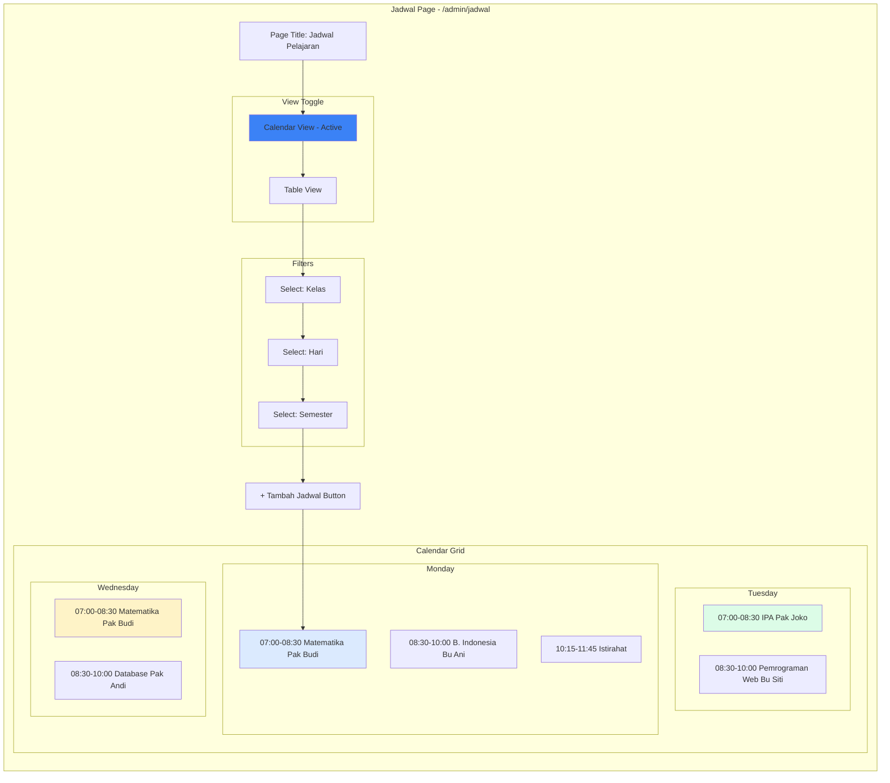

### 5. Jadwal Pelajaran Page - Table View

```mermaid
graph TB
    subgraph "Jadwal Table View"
        direction TB
        
        subgraph "Action Bar"
            V1[Calendar View]
            V2[Table View - Active]
            B1[+ Tambah Jadwal]
            E1[Export to PDF]
        end
        
        subgraph "Jadwal Table"
            TH[Headers: Hari | Jam | Mata Pelajaran | Guru | Kelas | Ruangan | Aksi]
            TR1[Senin | 07:00-08:30 | Matematika | Pak Budi | X RPL 1 | R.101 | Edit Delete]
            TR2[Senin | 08:30-10:00 | B. Indonesia | Bu Ani | X RPL 1 | R.101 | Edit Delete]
            TR3[Selasa | 07:00-08:30 | IPA | Pak Joko | X RPL 1 | Lab.1 | Edit Delete]
        end
        
        P[Pagination]
        
        V1 --> V2
        V2 --> B1
        B1 --> E1
        E1 --> TH
        TH --> TR1
        TR1 --> TR2
        TR2 --> TR3
        TR3 --> P
    end
    
    style V2 fill:#3b82f6
    style B1 fill:#10b981
```

**Jadwal Table Columns:**
- Hari (Senin-Jumat)
- Jam (Start-End time)
- Mata Pelajaran
- Guru (Teacher name)
- Kelas
- Ruangan (Room number)
- Aksi (Edit, Delete, Duplicate)

---

## 📝 Form Component Specifications

### 1. UserForm Component

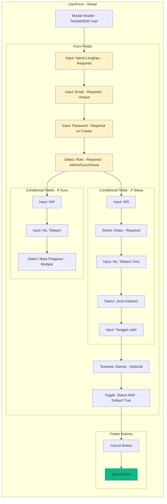

**UserForm Validation Rules:**
```javascript
{
  nama: {
    required: true,
    minLength: 3,
    maxLength: 100
  },
  email: {
    required: true,
    pattern: /^[^\s@]+@[^\s@]+\.[^\s@]+$/,
    unique: true
  },
  password: {
    required: mode === 'create',
    minLength: 8,
    pattern: /^(?=.*[a-z])(?=.*[A-Z])(?=.*\d)/
  },
  role: {
    required: true,
    enum: ['admin', 'guru', 'siswa']
  },
  nip: {
    required: role === 'guru',
    pattern: /^\d{18}$/
  },
  nis: {
    required: role === 'siswa',
    pattern: /^\d{10}$/
  },
  kelas_id: {
    required: role === 'siswa'
  }
}
```

### 2. JurusanForm Component

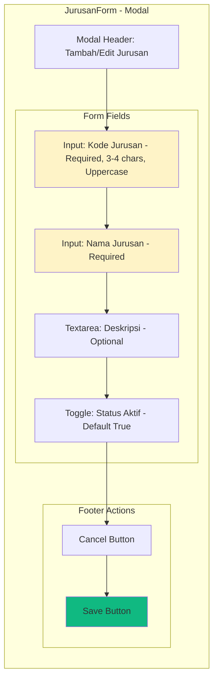

**JurusanForm Props:**
```javascript
{
  mode: 'create' | 'edit',
  initialData: {
    kode: string,
    nama: string,
    deskripsi: string,
    is_active: boolean
  },
  onSubmit: (data) => void,
  onCancel: () => void,
  loading: boolean
}
```

### 3. KelasForm Component

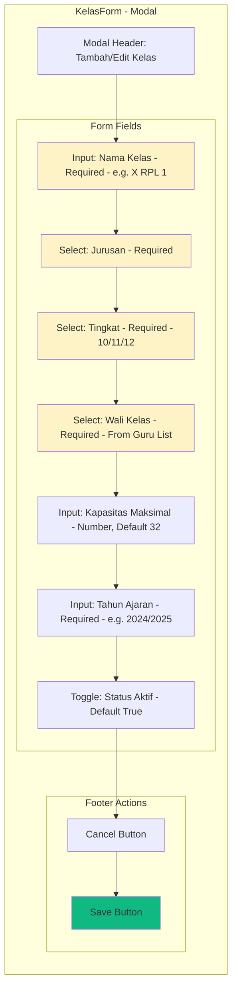

**KelasForm Validation:**
```javascript
{
  nama: {
    required: true,
    pattern: /^(X|XI|XII)\s[A-Z]+\s\d+$/,
    example: 'X RPL 1'
  },
  jurusan_id: {
    required: true
  },
  tingkat: {
    required: true,
    enum: [10, 11, 12]
  },
  wali_kelas_id: {
    required: true
  },
  kapasitas: {
    required: true,
    min: 1,
    max: 50,
    default: 32
  },
  tahun_ajaran: {
    required: true,
    pattern: /^\d{4}\/\d{4}$/
  }
}
```

### 4. MataPelajaranForm Component

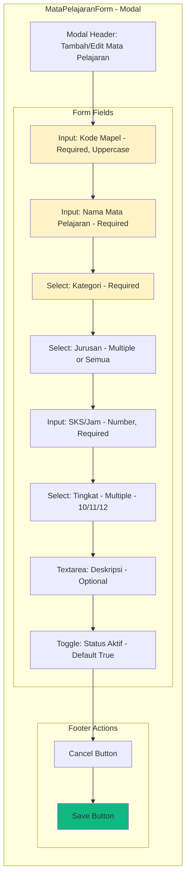

**Kategori Options:**
- Umum (Matematika, B. Indonesia, B. Inggris, IPA, IPS)
- Produktif (Specific to Jurusan)
- Muatan Lokal (Local content)

### 5. JadwalForm Component

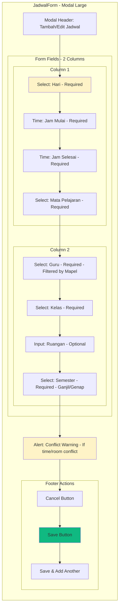

**JadwalForm Features:**
- Auto-detect time conflicts
- Filter guru by mata pelajaran
- Validate time range (jam_selesai > jam_mulai)
- Show existing jadwal for selected kelas
- Duplicate jadwal feature

**Hari Options:**
```javascript
['Senin', 'Selasa', 'Rabu', 'Kamis', 'Jumat', 'Sabtu']
```

---

## 🎯 Form Field Types Reference

### Text Input Variants

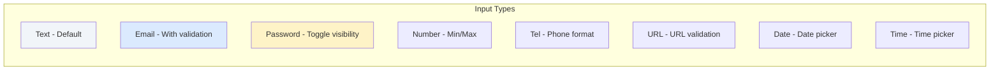

### Select/Dropdown Variants

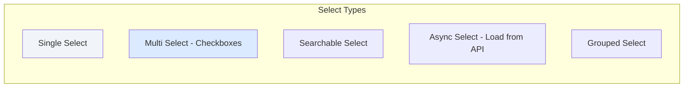

### Other Input Types

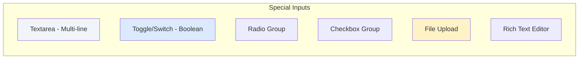

---

## 🔄 CRUD Operation Flows

### Create Flow

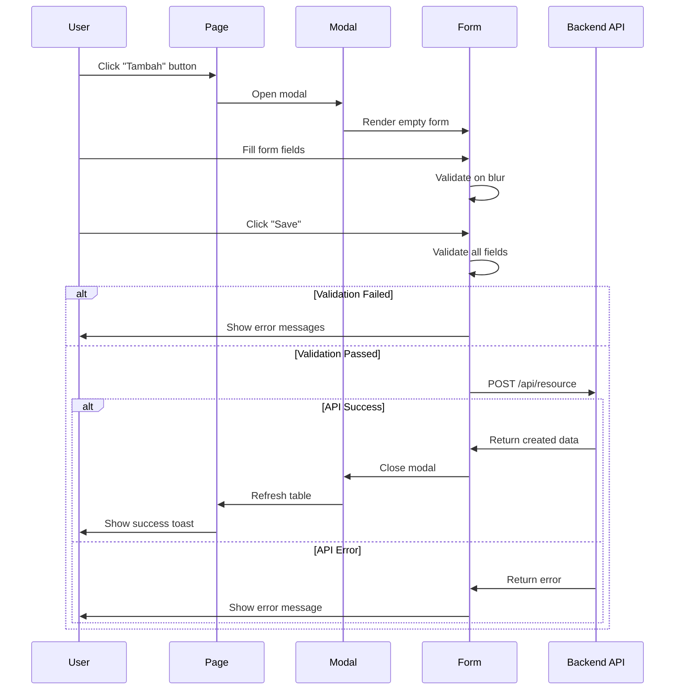

### Edit Flow

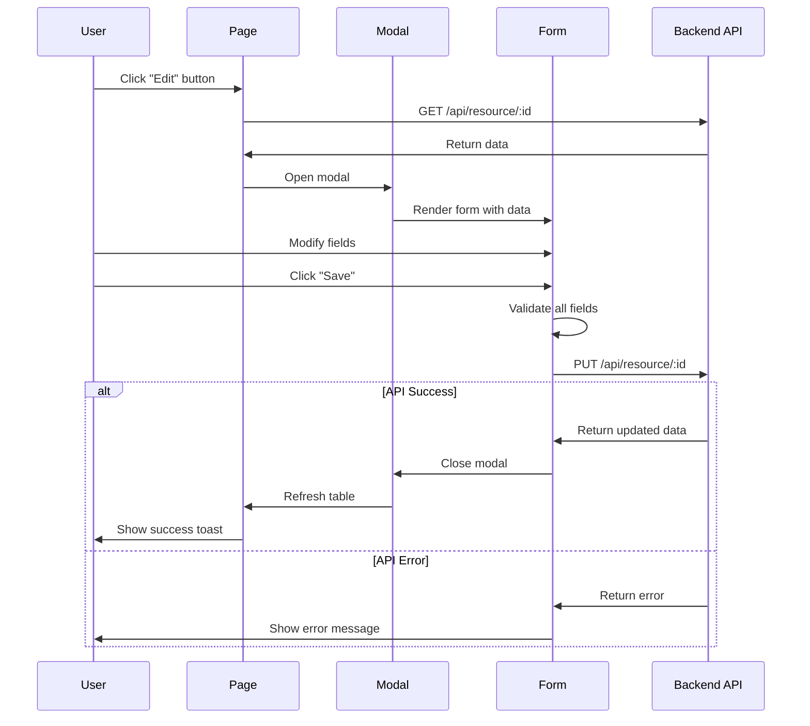

### Delete Flow

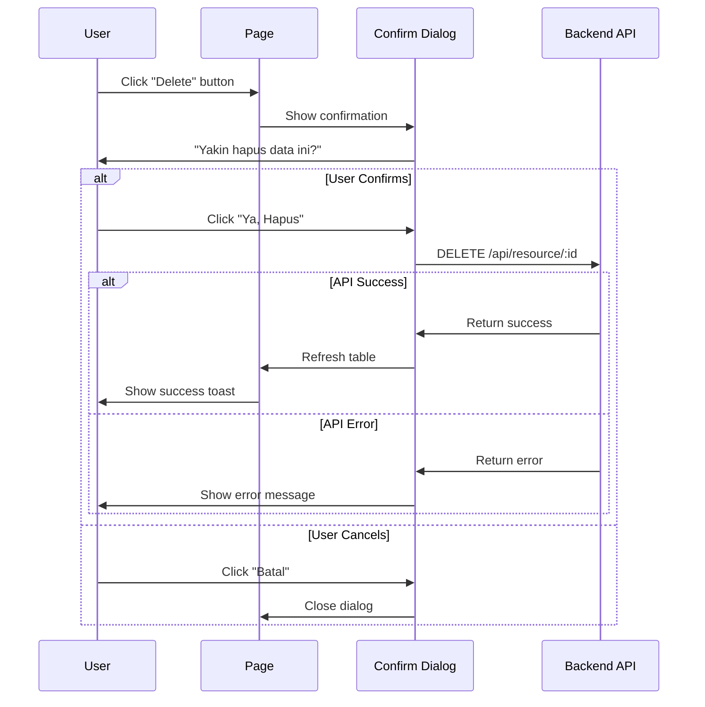

---

## 📊 Table Features Specification

### Sortable Columns

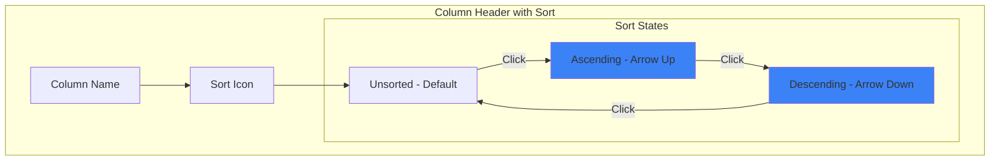

### Bulk Actions

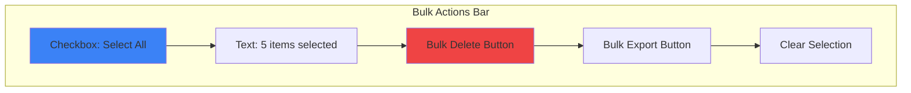

### Pagination Component

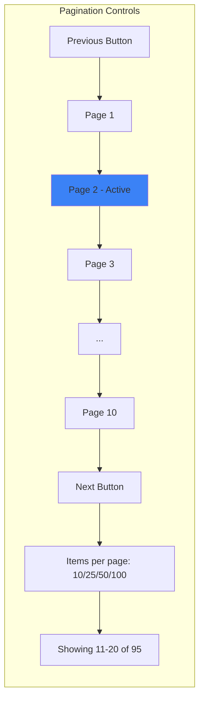

---

**Status:** ✅ Priority 2 Complete - Ready for Phase 4 Implementation!
