# 🎨 Priority 3 Wireframes - Before Phase 5 (File Upload & Grading)

## 📤 File Upload Component Design

### 1. File Upload Area - Drag & Drop

```mermaid
graph TB
    subgraph "FileUpload Component"
        direction TB
        
        subgraph "Upload Area - Default State"
            I1[Upload Icon - Large]
            T1[Drag & drop file here]
            T2[or]
            B1[Browse Files Button]
            T3[Max size: 10MB | Allowed: PDF, DOC, DOCX, PPT, PPTX, ZIP]
        end
        
        subgraph "Upload Area - Drag Over State"
            I2[Upload Icon - Animated]
            T4[Drop file to upload]
            BG[Background: Blue highlight]
        end
        
        subgraph "Upload Area - Uploading State"
            P[Progress Bar]
            PT[Uploading... 45%]
            BC[Cancel Button]
        end
        
        subgraph "Upload Area - Success State"
            I3[Check Icon - Green]
            T5[File uploaded successfully]
            F[File Preview Card]
        end
        
        subgraph "Upload Area - Error State"
            I4[Error Icon - Red]
            T6[Upload failed: File too large]
            BR[Retry Button]
        end
    end
    
    style BG fill:#dbeafe
    style P fill:#3b82f6
    style I3 fill:#10b981
    style I4 fill:#ef4444
```

### 2. File Preview Card

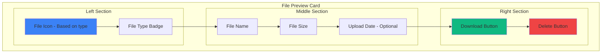

### 3. Multiple File Upload

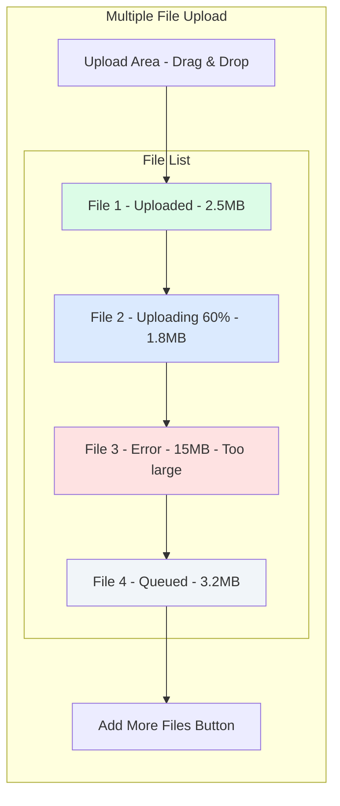

### 4. File Type Icons

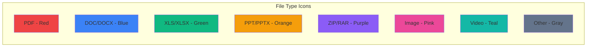

### 5. Upload Progress Indicator

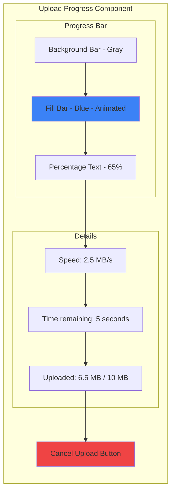

---

## 📝 Guru: Materi Upload Form

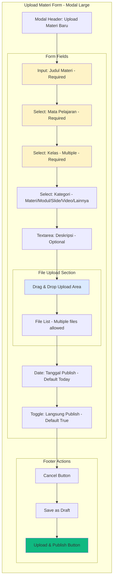

**Materi Upload Validation:**
```javascript
{
  judul: {
    required: true,
    minLength: 5,
    maxLength: 200
  },
  mata_pelajaran_id: {
    required: true
  },
  kelas_ids: {
    required: true,
    minItems: 1
  },
  files: {
    required: true,
    maxSize: 10 * 1024 * 1024, // 10MB per file
    allowedTypes: [
      'application/pdf',
      'application/msword',
      'application/vnd.openxmlformats-officedocument.wordprocessingml.document',
      'application/vnd.ms-powerpoint',
      'application/vnd.openxmlformats-officedocument.presentationml.presentation',
      'application/zip',
      'video/mp4',
      'image/jpeg',
      'image/png'
    ]
  }
}
```

---

## 📊 Guru: Nilai Input - Inline Table Design

```mermaid
graph TB
    subgraph "Nilai Input Page - /guru/nilai"
        direction TB
        
        T[Page Title: Input Nilai]
        
        subgraph "Filter Section"
            F1[Select: Kelas - Required]
            F2[Select: Mata Pelajaran - Required]
            F3[Select: Jenis Nilai - Required]
            B1[Load Data Button]
        end
        
        subgraph "Nilai Table - Inline Edit"
            TH[Headers: No | NIS | Nama Siswa | Nilai | Keterangan | Status]
            
            subgraph "Row 1"
                R1C1[1]
                R1C2[1001]
                R1C3[Ahmad Fauzi]
                R1C4[Input: 85 - Auto validate 0-100]
                R1C5[Input: Bagus]
                R1C6[Badge: Saved]
            end
            
            subgraph "Row 2"
            R2C1[2]
                R2C2[1002]
                R2C3[Siti Nurhaliza]
                R2C4[Input: 92 - Modified]
                R2C5[Input: Excellent]
                R2C6[Badge: Modified]
            end
            
            subgraph "Row 3"
                R3C1[3]
                R3C2[1003]
                R3C3[Budi Santoso]
                R3C4[Input: Empty]
                R3C5[Input: Empty]
                R3C6[Badge: Not Filled]
            end
        end
        
        subgraph "Summary Section"
            S1[Total Siswa: 30]
            S2[Sudah Dinilai: 25]
            S3[Belum Dinilai: 5]
            S4[Rata-rata: 82.5]
        end
        
        subgraph "Action Buttons"
            B2[Save All Changes]
            B3[Export to Excel]
            B4[Reset Changes]
        end
        
        T --> F1
        F1 --> F2
        F2 --> F3
        F3 --> B1
        B1 --> TH
        TH --> R1C1
        R1C1 --> R1C2
        R1C2 --> R1C3
        R1C3 --> R1C4
        R1C4 --> R1C5
        R1C5 --> R1C6
        R1C6 --> R2C1
        R2C1 --> S1
        S1 --> S2
        S2 --> S3
        S3 --> S4
        S4 --> B2
        B2 --> B3
        B3 --> B4
    end
    
    style R1C6 fill:#10b981
    style R2C6 fill:#f59e0b
    style R3C6 fill:#64748b
    style B2 fill:#10b981
```

### Jenis Nilai Options

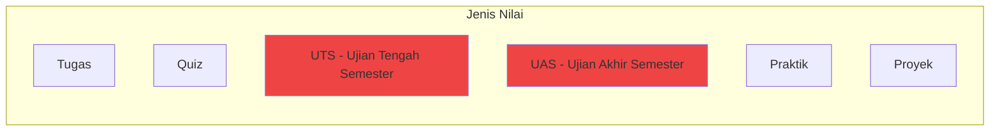

### Inline Edit Features

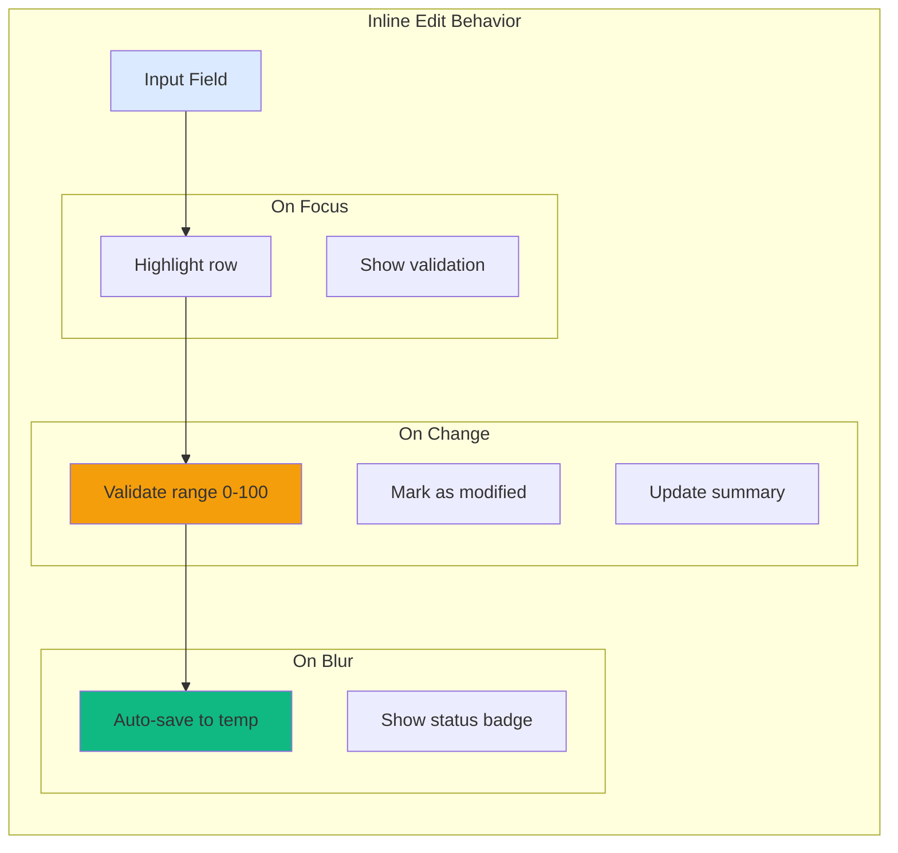

---

## 📋 Guru: Absensi Input Page Detail

```mermaid
graph TB
    subgraph "Absensi Input Page - /guru/absensi"
        direction TB
        
        T[Page Title: Input Absensi]
        
        subgraph "Filter Section"
            F1[Select: Kelas - Required]
            F2[Select: Mata Pelajaran - Required]
            F3[Date: Tanggal - Default Today]
            F4[Time: Jam Pelajaran - Optional]
            B1[Load Data Button]
        end
        
        subgraph "Quick Actions"
            Q1[Set All: Hadir]
            Q2[Set All: Sakit]
            Q3[Set All: Izin]
            Q4[Set All: Alpha]
        end
        
        subgraph "Absensi Table"
            TH[Headers: No | NIS | Nama | Foto | Status | Keterangan]
            
            subgraph "Row 1"
                R1C1[1]
                R1C2[1001]
                R1C3[Ahmad Fauzi]
                R1C4[Avatar]
                R1C5[Button Group: H S I A]
                R1C6[Input: Optional]
            end
            
            subgraph "Row 2"
                R2C1[2]
                R2C2[1002]
                R2C3[Siti Nurhaliza]
                R2C4[Avatar]
                R2C5[Button Group: H S I A]
                R2C6[Input: Demam]
            end
        end
        
        subgraph "Summary"
            S1[Hadir: 28]
            S2[Sakit: 1]
            S3[Izin: 1]
            S4[Alpha: 0]
            S5[Total: 30]
        end
        
        subgraph "Actions"
            B2[Save Absensi]
            B3[Export to PDF]
        end
        
        T --> F1
        F1 --> F2
        F2 --> F3
        F3 --> F4
        F4 --> B1
        B1 --> Q1
        Q1 --> Q2
        Q2 --> Q3
        Q3 --> Q4
        Q4 --> TH
        TH --> R1C1
        R1C1 --> S1
        S1 --> S2
        S2 --> S3
        S3 --> S4
        S4 --> S5
        S5 --> B2
        B2 --> B3
    end
    
    style Q1 fill:#10b981
    style R1C5 fill:#dbeafe
    style B2 fill:#10b981
```

### Status Button Group

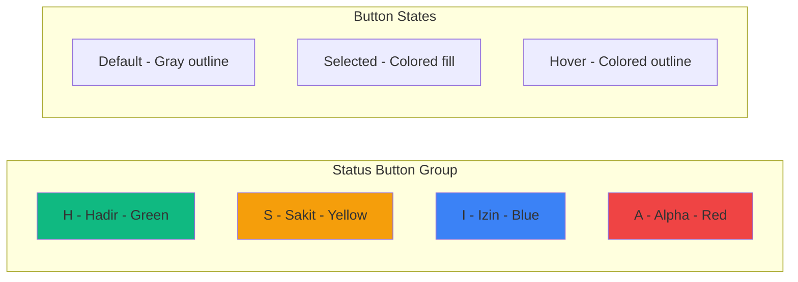

### Absensi Keyboard Shortcuts

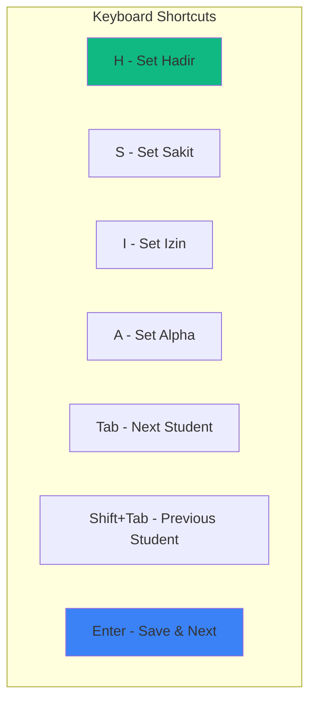

---

## 📝 Tugas Submission Detail Page (Grading)

```mermaid
graph TB
    subgraph "Tugas Submission Detail - /guru/tugas/:id/submissions"
        direction TB
        
        subgraph "Header Section"
            T[Tugas Title: Membuat Website E-Commerce]
            I[Info: Deadline: 2024-01-20 | Submitted: 25/30 | Graded: 15/25]
        end
        
        subgraph "Filter & Actions"
            F1[Filter: All/Submitted/Not Submitted/Graded/Not Graded]
            F2[Sort: Name/Submit Time/Score]
            B1[Export Grades]
            B2[Send Reminder to Not Submitted]
        end
        
        subgraph "Submission List"
            subgraph "Card 1 - Submitted & Graded"
                C1H[Ahmad Fauzi - 1001]
                C1S[Submitted: 2024-01-18 10:30 - On Time]
                C1F[Files: project.zip - 2.5MB]
                C1N[Catatan: Sudah bagus, tambahkan validasi]
                C1G[Nilai: 85 - Badge Green]
                C1A[View Files | Edit Grade]
            end
            
            subgraph "Card 2 - Submitted Not Graded"
                C2H[Siti Nurhaliza - 1002]
                C2S[Submitted: 2024-01-19 23:45 - On Time]
                C2F[Files: tugas.zip - 3.1MB]
                C2N[Catatan: -]
                C2G[Nilai: - - Badge Yellow]
                C2A[View Files | Grade Now]
            end
            
            subgraph "Card 3 - Not Submitted"
                C3H[Budi Santoso - 1003]
                C3S[Not Submitted - Badge Red]
                C3F[Files: -]
                C3N[Catatan: -]
                C3G[Nilai: 0]
                C3A[Send Reminder]
            end
        end
        
        T --> I
        I --> F1
        F1 --> F2
        F2 --> B1
        B1 --> B2
        B2 --> C1H
        C1H --> C2H
        C2H --> C3H
    end
    
    style C1G fill:#10b981
    style C2G fill:#f59e0b
    style C3S fill:#ef4444
```

### Grading Modal

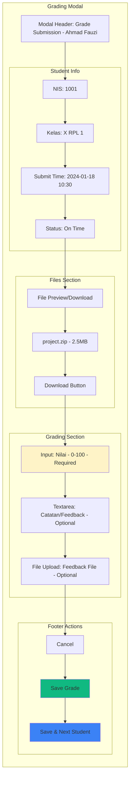

### Submission Status Badges

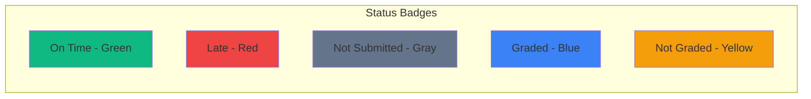

---

## 📥 Siswa: Tugas Submission Form

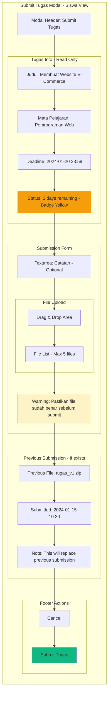

### Deadline Warning States

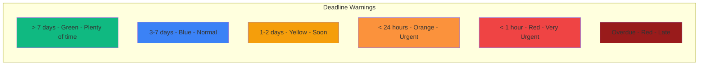

---

## 🎯 File Upload Props & API

### FileUpload Component Props

```javascript
{
  // Basic props
  accept: string, // MIME types, e.g., "application/pdf,.doc,.docx"
  maxSize: number, // in bytes, e.g., 10 * 1024 * 1024 for 10MB
  maxFiles: number, // max number of files, default 1
  multiple: boolean, // allow multiple files
  
  // UI props
  label: string,
  helperText: string,
  error: string,
  disabled: boolean,
  showPreview: boolean, // show file preview cards
  
  // Callbacks
  onUpload: (files: File[]) => Promise<void>,
  onDelete: (fileId: string) => Promise<void>,
  onError: (error: Error) => void,
  
  // Initial files (for edit mode)
  initialFiles: Array<{
    id: string,
    name: string,
    size: number,
    url: string,
    type: string
  }>,
  
  // Advanced
  uploadOnSelect: boolean, // auto upload on file select
  showProgress: boolean, // show upload progress
  allowedTypes: string[], // custom validation
}
```

### Upload API Endpoints

```javascript
// Upload file
POST /api/files/upload
Content-Type: multipart/form-data
Body: {
  file: File,
  type: 'materi' | 'tugas' | 'submission',
  related_id: number // optional
}
Response: {
  id: number,
  name: string,
  path: string,
  url: string,
  size: number,
  mime_type: string
}

// Delete file
DELETE /api/files/:id
Response: {
  message: 'File deleted successfully'
}

// Download file
GET /api/files/:id/download
Response: File stream
```

---

## 📊 Grading Statistics Component

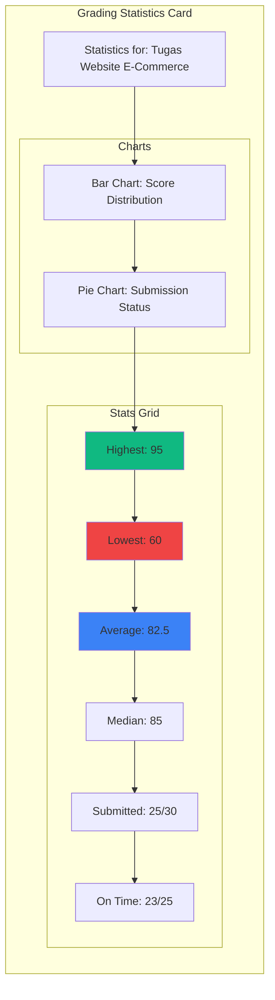

---

## 🔔 Notification System for Submissions

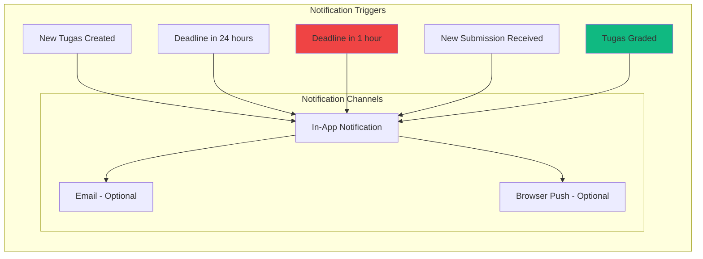

---

**Status:** ✅ Priority 3 Complete - Ready for Phase 5 Implementation!

## 📝 Summary

### File Upload Features
- ✅ Drag & drop interface
- ✅ Multiple file support
- ✅ Progress indicator
- ✅ File type validation
- ✅ Size validation
- ✅ Preview cards
- ✅ Error handling

### Nilai Input Features
- ✅ Inline table editing
- ✅ Auto-validation (0-100)
- ✅ Real-time summary
- ✅ Bulk save
- ✅ Export to Excel
- ✅ Status indicators

### Absensi Input Features
- ✅ Quick status buttons (H/S/I/A)
- ✅ Keyboard shortcuts
- ✅ Bulk actions
- ✅ Real-time summary
- ✅ Export to PDF

### Tugas Grading Features
- ✅ Submission list with filters
- ✅ File preview/download
- ✅ Inline grading
- ✅ Feedback system
- ✅ Statistics dashboard
- ✅ Deadline warnings
- ✅ Notification system
